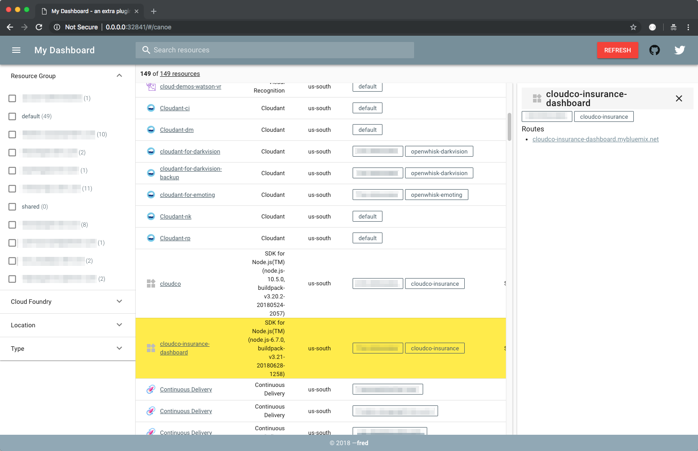

# Little plugin experiment

A plugin for the IBM Cloud CLI exposing a user interface to view your resources a bit differently.



## Install the plugin

```
ibmcloud plugin repo-add extra https://l2fprod.github.io/extra/
ibmcloud plugin install extra -r extra
```

## Use the plugin

1. Start the dashboard
   ```
   $ ibmcloud extra
   Listening at http://localhost:45925
   ```
1. Open the link into a web browser (tested with Chrome)
1. Click the `Refresh` button to get a snapshot of the resources in the current account.
1. Use the search and filters to navigate resources

> The port where `extra` is listening can be changed with `EXTRA_PORT=8080 ibmcloud extra`.

## Development

### Build plugin

```
brew install go
brew install govendor
cd extra-plugin
export GOPATH=$PWD
go get -u github.com/gobuffalo/packr/...
./build.sh
```

### Install plugin

```
ibmcloud plugin install ./src/extra/build/extra-linux-amd64-<version> -f
```

### Run plugin

```
EXTRA_PORT=38080 ibmcloud extra
```

### Run UI

```
yarn
EXTRA_PORT=38080 yarn serve
```
